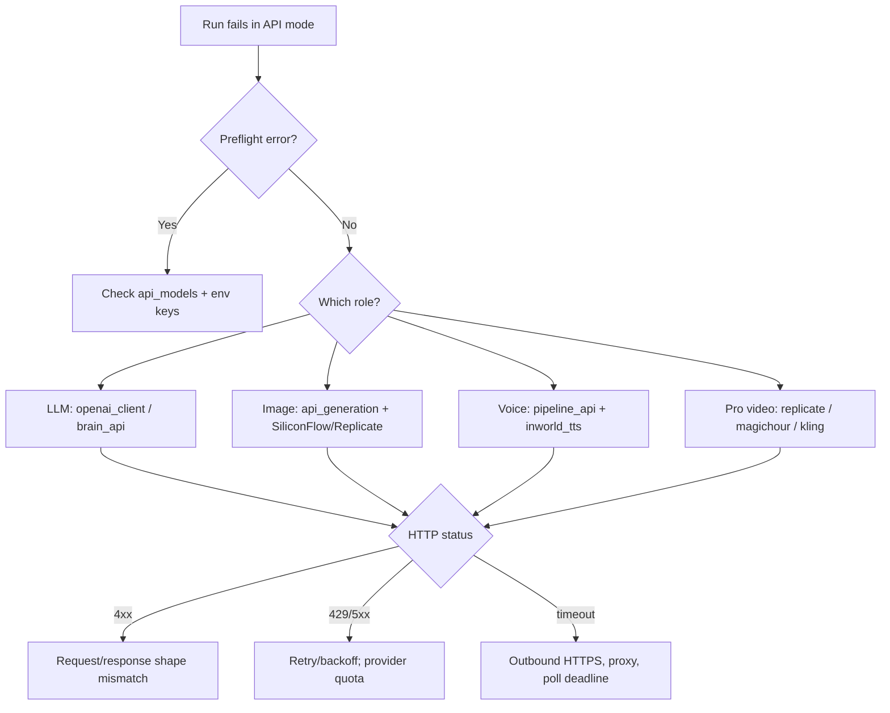

# API mode review checklist

Runbook-style companion to [../integrations/api_generation.md](../integrations/api_generation.md). Follow the phases in order; each table lists what to **do**, the **pass criteria**, and **where to look** if a step fails. This file intentionally only covers the **API execution mode** (`model_execution_mode: "api"`); local HF-weights review is out of scope.

## 1. Scope

"API mode works" means, for this review:

- `model_execution_mode` is `api` in [`ui_settings.json`](../reference/config.md) and in the running process.
- No local Hugging Face diffusion / causal-LM weights are loaded for roles that are delegated to HTTP providers (LLM, stills, Pro text-to-video, voice when not local).
- [`api_preflight_errors`](../../src/runtime/model_backend.py) blocks a run when required keys / provider choices are missing, and lets a fully configured run start.
- End-to-end artifacts (script JSON, stills PNGs, voice WAVs, optional Pro MP4, final muxed video) are produced by the selected cloud providers — FFmpeg / MoviePy assembly still runs locally.

## 2. Prerequisites

- `model_execution_mode: "api"` set from the Model tab or in `ui_settings.json`.
- Env vars for the providers under test (see the table in [../integrations/api_generation.md](../integrations/api_generation.md#environment-variables-env-wins-over-saved-keys)):
  - `OPENAI_API_KEY` (fallback bearer), plus any of `GEMINI_API_KEY` / `GOOGLE_API_KEY`, `SILICONFLOW_API_KEY`, `KLING_ACCESS_KEY` + `KLING_SECRET_KEY`, `MAGIC_HOUR_API_KEY`, `INWORLD_API_KEY`, `REPLICATE_API_TOKEN`, `ELEVENLABS_API_KEY` as applicable.
- Working internet egress on `443/tcp` to the provider hosts; no MITM proxy stripping `Authorization`.
- Run the non-Qt API unit tests first (fast gate, no network):

```powershell
pytest tests/test_model_backend.py tests/test_preflight.py tests/test_api_generation.py tests/test_api_model_catalog.py tests/test_kling_client.py tests/test_openai_client.py -q
```

All green → proceed. Any failure → fix before running phases below; most failures here will also break the live run.

## 3. Phase A — UI + settings

| # | Action | Pass criteria | If it fails, investigate |
|---|--------|---------------|--------------------------|
| A1 | Launch the desktop UI and open the **Model** tab. Toggle **Local ↔ API**. | Local HF controls hide in API mode; the **API** Generation rows (LLM / Image / Voice / Pro video) show. | [`UI/main_window.py`](../../UI/main_window.py) — `_sync_api_gen_row_states` and the Model tab builders. |
| A2 | With only a subset of env keys present, open each row's **Provider** dropdown. | Rows whose provider has an env key (or a saved key, per the rules in [`src/runtime/model_backend.py`](../../src/runtime/model_backend.py)) are enabled; others are disabled with a tooltip hint. | [`UI/services/api_model_widgets.py`](../../UI/services/api_model_widgets.py) and `provider_has_key` in [`src/runtime/model_backend.py`](../../src/runtime/model_backend.py). |
| A3 | Pick a recommended default per role (Gemini, SiliconFlow, Inworld, Kling), click **Save**, restart the app. | `ui_settings.json` round-trips the `api_models` / `api_openai_key` / provider picks; the UI re-loads the same selection. | [`src/settings/api_model_catalog.py`](../../src/settings/api_model_catalog.py) and the `AppSettings` load/save in [`src/settings`](../../src/settings). |

## 4. Phase B — Preflight

[`api_preflight_errors`](../../src/runtime/model_backend.py) is invoked from [`src/runtime/preflight.py`](../../src/runtime/preflight.py) before a run starts.

| # | Action | Pass criteria | If it fails, investigate |
|---|--------|---------------|--------------------------|
| B1 | Configure **all** required keys for the chosen row set and start a Video run. | Preflight returns `[]` and the pipeline proceeds. | [`src/runtime/preflight.py`](../../src/runtime/preflight.py), `effective_*_api_key` helpers in [`src/runtime/model_backend.py`](../../src/runtime/model_backend.py). |
| B2 | Unset the LLM key (e.g. remove `OPENAI_API_KEY` / `GEMINI_API_KEY` / saved bearer) and start a run. | Preflight returns a human-readable error mentioning the missing LLM key and the run is blocked. | `api_preflight_errors` — LLM branch. |
| B3 | Enable **Pro** mode and set **Video provider** to `replicate` (no `REPLICATE_API_TOKEN`). Repeat for `magic_hour` (no `MAGIC_HOUR_API_KEY`) and `kling` (missing either `KLING_ACCESS_KEY` or `KLING_SECRET_KEY`). | Each case returns a distinct, provider-specific error. | `api_preflight_errors` — Pro-video branch; double-check the Kling branch requires **both** access + secret. |
| B4 | Switch to **Photo** mode with no Pro video requested. | Preflight ignores the Pro-video branch and only validates LLM + Image. | `api_preflight_errors` — Photo branch. |

## 5. Phase C — Script LLM

| # | Action | Pass criteria | If it fails, investigate |
|---|--------|---------------|--------------------------|
| C1 | Run a minimal script step with **LLM = OpenAI** (or any OpenAI-compatible provider you have a key for). | Returns a `VideoPackage`-shaped JSON; no local HF transformers imports appear in logs. | [`src/runtime/generation_facade.py`](../../src/runtime/generation_facade.py) (`get_generation_facade`), [`src/content/brain_api.py`](../../src/content/brain_api.py). |
| C2 | Switch **LLM = Google AI Studio (Gemini)** and re-run. | Chat completes against `…/v1beta/openai` (no duplicated `/v1`). | `_normalize_openai_api_base_path` in [`src/platform/openai_client.py`](../../src/platform/openai_client.py); unit test `test_build_client_gemini_base_no_double_v1` in [`tests/test_openai_client.py`](../../tests/test_openai_client.py). |
| C3 | Force a malformed JSON response (e.g. temperature + model id without JSON-mode). | The API path surfaces a parse error rather than producing a half-written run. | `generate_script_openai` in [`src/content/brain_api.py`](../../src/content/brain_api.py). |

## 6. Phase D — Image stills

| # | Action | Pass criteria | If it fails, investigate |
|---|--------|---------------|--------------------------|
| D1 | With **Image = OpenAI**, trigger one still. | 1 PNG saved to the run's `images/` folder. | OpenAI image branch in [`src/runtime/api_generation.py`](../../src/runtime/api_generation.py) + [`src/platform/openai_client.py`](../../src/platform/openai_client.py) (`download_image_png`). |
| D2 | With **Image = SiliconFlow** and `SILICONFLOW_API_KEY` set, trigger one still. | PNG saved; response may be a URL (downloaded) or base64 (decoded). | `build_image_generation_openai_client` in [`src/platform/openai_client.py`](../../src/platform/openai_client.py) — SiliconFlow routing; `download_image_png` URL fallback. |
| D3 | With **Image = Replicate** + a known version id, trigger one still. | PNG saved; poll loop terminates on `succeeded`. | [`src/platform/replicate_client.py`](../../src/platform/replicate_client.py); unit test [`tests/test_replicate_client.py`](../../tests/test_replicate_client.py). |

## 7. Phase E — Voice

| # | Action | Pass criteria | If it fails, investigate |
|---|--------|---------------|--------------------------|
| E1 | **Voice = OpenAI TTS** (`tts-1` / `tts-1-hd`) on a short script. | WAV file(s) produced; duration roughly matches text length. | [`src/runtime/pipeline_api.py`](../../src/runtime/pipeline_api.py) OpenAI TTS branch; [`src/platform/openai_client.py`](../../src/platform/openai_client.py). |
| E2 | **Voice = Inworld** (`INWORLD_API_KEY`), long narration spanning multiple chunks. | A single concatenated WAV; no gaps at chunk boundaries. | [`src/speech/inworld_tts.py`](../../src/speech/inworld_tts.py) (`synthesize_inworld_to_wav`, `_inworld_tts_bytes`, `_mp3_bytes_to_wav`, `_concat_wavs`). |
| E3 | A character config selects **ElevenLabs** while the global Voice row is OpenAI / Inworld. | That character line uses the ElevenLabs path without breaking the rest of the run. | ElevenLabs branch in [`src/runtime/pipeline_api.py`](../../src/runtime/pipeline_api.py) and [`tests/test_elevenlabs_tts.py`](../../tests/test_elevenlabs_tts.py). |

## 8. Phase F — Pro video

Run one case per available provider; each clip is typically ~5s at 9:16.

| # | Action | Pass criteria | If it fails, investigate |
|---|--------|---------------|--------------------------|
| F1 | **Pro = Replicate** with a valid video version id. | MP4 written to the run folder; poll exits cleanly. | [`src/platform/replicate_client.py`](../../src/platform/replicate_client.py). |
| F2 | **Pro = Magic Hour** (`MAGIC_HOUR_API_KEY`). | MP4 written; create → poll → download succeeds within the configured timeout. | [`src/platform/magichour_client.py`](../../src/platform/magichour_client.py) — `text_to_video_mp4_bytes`. |
| F3 | **Pro = Kling** (`KLING_ACCESS_KEY` + `KLING_SECRET_KEY`). | MP4 written; JWT is fresh on each request; the nested-body path is used, with a graceful flat-body fallback on 400. | [`src/platform/kling_client.py`](../../src/platform/kling_client.py) — `kling_bearer_jwt`, `kling_text_to_video_mp4_bytes`, `_extract_video_url`; unit tests [`tests/test_kling_client.py`](../../tests/test_kling_client.py). |

## 9. Phase G — Full runs

| # | Action | Pass criteria | If it fails, investigate |
|---|--------|---------------|--------------------------|
| G1 | **Video + slideshow** (Image stills + Voice + local FFmpeg mux; no Pro). | Final MP4 contains narration over stills with captions / music as configured. | [`src/runtime/pipeline_api.py`](../../src/runtime/pipeline_api.py) → `run_once_api`. |
| G2 | **Video + Pro** (slideshow plus one Pro clip from Kling / Magic Hour / Replicate). | Final MP4 includes the Pro clip interleaved with stills; timeline duration matches voice track. | `cloud_video_mp4_paths` in [`src/runtime/api_generation.py`](../../src/runtime/api_generation.py). |
| G3 | **Photo** mode end-to-end. | Output image set is written; Pro-video branch is skipped entirely. | Photo branch of `run_once_api`. |

## 10. Cross-cutting

| Topic | What to verify | Where |
|-------|----------------|-------|
| Env vs saved keys | An env var beats the saved `api_openai_key` / `api_replicate_token`. Tooltips in the UI call this out. | `effective_*_api_key` in [`src/runtime/model_backend.py`](../../src/runtime/model_backend.py); [`UI/services/api_model_widgets.py`](../../UI/services/api_model_widgets.py). |
| 429 / 5xx retries + backoff | A synthetic rate-limit doesn't crash the run; the client retries with exponential backoff, then surfaces a clean error on exhaustion. | Retry helpers in [`src/platform/openai_client.py`](../../src/platform/openai_client.py), [`src/platform/replicate_client.py`](../../src/platform/replicate_client.py), [`src/platform/magichour_client.py`](../../src/platform/magichour_client.py), [`src/platform/kling_client.py`](../../src/platform/kling_client.py). |
| Poll timeouts | Create-then-poll providers respect the configured timeout and fail fast instead of hanging. | `timeout=` parameter threads in the video clients above. |
| PyInstaller EXE import smoke | A packaged EXE can import the API-mode code paths with no optional local-only imports. | [`tests/test_import_smoke_api.py`](../../tests/test_import_smoke_api.py). |

## 11. Investigation decision tree



## 12. Sign-off

Tick all four to call this review pass:

- [ ] Phase A (UI + settings) — all three rows pass.
- [ ] Phase B (Preflight) — happy path + at least one missing-key case per role.
- [ ] One **G1** run (Video + slideshow) produced the final MP4.
- [ ] One **G2** run (Video + Pro) produced the final MP4 using one of Kling / Magic Hour / Replicate.

Optional:

- [ ] One **G3** run (Photo mode) completed.
